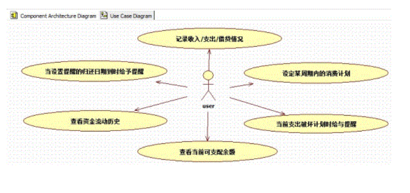

# 需求分析

用户需求规格说明书和产品需求规格说明书 二者相差不大 合二为一

# 1 引言

## 1.1 编写目的

如题，描述你编写这篇文档的目的和作用。但最关键的是，详细说明哪些人可以使用这篇文档，做什么。需求规格说明书是用来做什么的？毫无疑问，首先供用户与开发公司确认软件开发的业务需求、功能范围。其次呢，当然就是指导设计与开发人员设计开发系统。当然，还包括测试人员设计测试，技服人员编写用户手册，以及其它相关人员熟悉系统。描述这些，可以帮助读者确定，阅读这篇文档是否可以从中获得帮助。

## 1.2 业务背景

描述业务背景，是为了读者了解与该文档相关的人与事。你可以罗列与文档相关的各种事件，也可以描写与项目相关的企业现状、问题分析与解决思路，以及触发开发该项目的大背景、政策法规，等等。

## 1.3 项目目标（或任务概述）

就是项目能为用户带来什么利益，解决用户什么问题，或者说怎样才算项目成功。前面提到过，这部分对项目成功作用巨大。

## 1.4 参考资料

参考资料的名称、作者、版本、编写日期。

## 1.5 名词定义

没啥可说的，就是文档中可能使用的各种术语或名词的定义与约定，大家可以根据需要删减。

# 2总体描述

## 2.1 产品描述

系统功能：

人们迫切想知道自己的钱花到哪些地方了

目前的电子理财软件偏向于商业界别，主要用于企业。贵，复杂，不适合个人和家庭使用。

输入：

在操作该系统的过程中，除了通过按钮选择需要实现的功能外，其他功能如下：

1. 添加栏下，在资金收入、支出、借贷的部分中，需要输入的部分有金额、日期以及具体的原因。

2. 添加栏下,借贷的部分的输入包括借出/被借对象,对象联系方式,借出/借进的金额和借贷的开始时间以及终止时间

3. 可根据收入设置或取消在某段时期内每天支出金额限制(可分类)若某天超支则需要选定是否让该超支结果影响该月之后每天的支出金额

4. 在设置栏中,用户可以自己设置支出的分类项,使系统更为个性化

5. 输入包括在进入系统时对身份的验证信息。

输出:

该系统的输出主要就是检索出的信息主要是以往的资金流动历史

1. 在査询资金状况时(此处可以选择日期、资金使用方面为检索条件)会输出一张列表,上面活晰列出了资金支出/收入的具体金额,用途和日期。

2. 该系统也可以完成以天或月或年为时间单位,就对整体或单就某方面的资金支出画出折线图,让你更了解资金动态

3. 或者就支出中的各部分做出一张饼状图让你更活晰看到使用的各部分资金的比例

4. 当某天支出资金超支时,给出提醒,并可选择根据它调整该计划周期内的财务计划

5. 当借贷模块中,要还款或收取还款的时候,系统会予以提示。

整体数据流程：

## 2.2产品功能

该产品的功能包括

能记录用户的资金账户：如银行、股票、证券、现金、支付宝、微信、京东等其他网络账户。

对每笔费用的记录;

对收入的记录

以任意时间段给出支出收入列表或者会出支出资金折线图

以任意时间段给出该时间段内各类开销所占比例的图

可以设置超支，并对超支的情况给用户体视

存入或查看借贷相关信息，并体视还款或收取还款。

 

 

以下图展示了系统中所需要的功能

 

## 2.3用户类及其特征

这部分是对系统整体框架性地进行描述。

## 2.4 整体流程分析

绘制的整体行动图，及其对它的说明。

## 2.5 整体用例分析

绘制的整体用例图，以及对每个用例的用例说明。如果项目比较大，存在多个子系统，可以将用例图改为构件图，详细描述每个子系统及其相互的接口调用。

## 2.6 角色分析

> 一个用例图，描述系统中所有的角色及其相互关系。在随后的说明中，详细说明每个角色的定义及其作用。

## 2.7其他

> 这部分还可以根据项目需要编写其它的内容，如部署方案、网络设备、功能结构、软件架构、关键点难点技术方案，等等。

# 3 功能需求

### 3.1 需求获取

> 第二章的产品功能和整体流程分析，都是以组织或用户的角度出发，描述功能。而此处的需求获取是从开发人员的角度，对用户所需功能的描述。

##### 需求列表

| 功能名称               | 功能描述                                                     | 功能分类 | 功能评价                                                     |
| ---------------------- | ------------------------------------------------------------ | -------- | ------------------------------------------------------------ |
| 记录收入、开销相关功能 | 添加、删除、修改收入和开销的相关信息（金额，时间，备注，退款退货） | 基本功能 | 必要                                                         |
| 记录借贷相关 功能      | 添加、删除、修改借入借出的相关信息（金额，时间，备注，应还日期，原因） | 基本功能 | 必要                                                         |
| 计划表                 | 可以设置每天花费的最高值、超过最高值时可以设置提醒。         | 资金规划 | 必要                                                         |
| 提醒                   | 花费超支、应还日期时的提醒，频率可以设置                     | 提醒功能 | 必要，避免用户以往借贷日期带来的一系列不必要的麻烦，提醒用户注意自己的消费习惯 |
| 查看                   | 以列表的形式，可以按照花销分类及时间段查看详细的花销列表、统计、以及与收入的比例， 同时可以以折线图的形式画出开销和收入的变化趋势 以及分析开销各种类别的占比，占比的饼状图 | 查询功能 | 必要，便于客户查看消费历史，图表展示更灵活清楚。             |

### 3.2需求分析

#### 3.2.1 业务需求

> **业务需求**（Business requirement）**表示组织或客户高层次的目标**。 业务需求通常来自项目投资人、购买产品的客户、实际用户的管理者、市场营销部门或产品策划部门。业务需求描述了组织为什么要开发一个系统，即组织希望达到 的目标。使用前景和范围（vision and scope）文档来记录业务需求，这份文档有时也被称作项目轮廓图或市场需求（project charter 或 market requirement）文档。 

本系统作为一个个人项目，为了个人或家庭的美好生活希望所产生，不具有业务需求。不产生公司收益。

#### 3.2.2 用户需求

> **用户需求**（user requirement）**描述的是用户的目标，或用户要求系统必须能完成的任务**。用例、场景描述和事件――响应表都是表达用户需求的有效途径。也就是说用户需求描述了用户能使用系统来做些什么。

该系统的用户主要包括一类用户：即为对财务资金管理有需求的系统使用者。

##### 3.2.2.1用户需求描述：

主要有以下功能：

1记录每次的收入

2记录每次资金支出

3记录借贷情况

4设定某周期的计划表4

5当检测当前支出会破环计划时，给予提醒

6可选择设置借贷归还日期时，是否给予提醒

7查看资金流动历史

8查看当前可支配余额

##### 3.2.2.2用户需求用例图

#### 3.2.3接口需求

##### 3.2.3.1用户接口

##### 3.2.3.2硬件接口

##### 3.2.3.3软件接口

#### 3.2.4 功能需求

> **功能需求**（functional requirement）**规定开发人员必须在产品中实现的软件功能，用户利用这些功能来完成任务，满足业务需求**。功能需求有时也被称作行为需求（behavīoral requirement），因为习惯上总是用“应该”对其进行描述：“系统应该发送电子邮件来通知用户已接受其预定”。功能需求描述是开发人员需要实现什么。 注意：用户需求不总是被转变成功能需求。用户需求和业务需求相结合构成了功能需求。

>  **一个一个描述系统中的每个功能模块（或子系统），即整体用例分析中的每个用例。这部分是需求规格说明书最主要的部分。**

##### 1、统计

**A 查看历史**

查看资金流动历史。可以输入实践来查看历史资金流动。界面中有时间栏、可以以年为单位，可以以月为单位、可以以日为单位。

若世间栏输入年，则显示年的总收入、总支出、总结余。

**B查看余额**

余额是由收入与支出的差值计算算来的。

但参考余额记账法，用户可以自己更改修改余额。修改带来的误差可以单独记录条目，而不计入收入和支出。

C查看应还借贷（这个应该包含在查看余额中？）

D查看应收账款（这个应该包含在查看余额中？）

##### 2、设置

借贷提醒设置

 超值提醒？

任务计划的设置i

所有的设置应该汇总到一个界面

##### 3、物品管理

这里的物品是指能够形成收入 或者支出的物品 比如车子，修车造成支出。

##### 3、收支管理

**A 收入支出的分类**

指本次收入支出的来源、去向。默认的收入类别有工资、奖金等

支出类别有娱乐 餐饮等 

这些类别可以自定义。就是标签的功能，标签需要分级么？

B **收入支出的记录**

时间 （默认为当前时间，可以修改）、金额  、分类标签、备注 

##### 4、借贷管理

借入、借出  （利息怎么算？）

还入、还出  （利息怎么算？）

A出 

可以为新建（借出），也可以为已有借入的还款

B入

可以为已有借出的还入，也可以为新的 借入。

C借贷记录

时间 预计还款时间 金额  备注 ，还可以添加提醒。

所以 这里是分出入 两个界面呢  还是 设置四个界面？ 两个界面更合理以下吧？

##### 5、账户管理

用户登录、提供用户对用户个人信息的管理和修改以及对系统信息进行备份和回复。

还有修改密码的功能。

##### 6、角色管理

以及团体中对用户的角色管理。比如可以添加家庭成员、删除家庭成员、设置户主角色。只有户主可以添加删除成员。

邀请团队成员、删除团队成员

每人有一个默认团体 ：本人

##### 7、账本管理

每人有一个默认账本

团体有一个默认账本

团体的账本会添加到每个人的账本列表中。

用户可以设置账本是否计入到个人收支记录（还是采用计入，后期再对消的策略？）

标签主管类别、账本主管范围。

##### 8、导入导出

#### 3.2.5 非功能需求

##### **性能需求**

时间长 数字精度高 事务完整性

##### 可用性

##### **操作界面和平台需求**

web、小程序 后续 app端

当面对错误用例：

A停电终端、数据恢复到最后一次修改保存后的状态。

B系统重装时 、可以拷贝数据库或者本软件的数据存储格式文档来回复、

如果数据库文件损坏，则无法恢复、用户应自觉定期数据备份

后续可以云同步

CBug提交

用户可以邮件发送bug

##### 安全性

##### 用户文档需求

##### 其他需求

